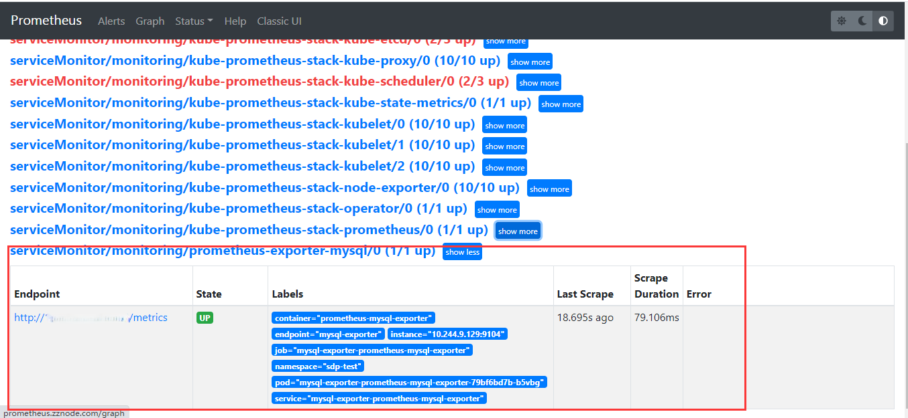
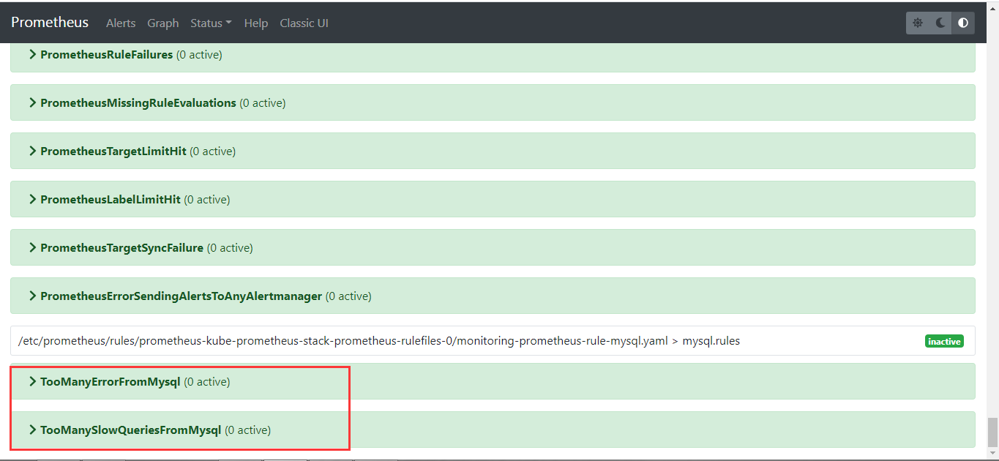
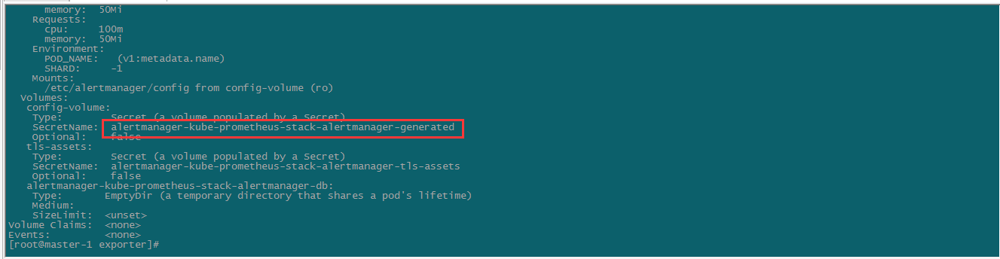
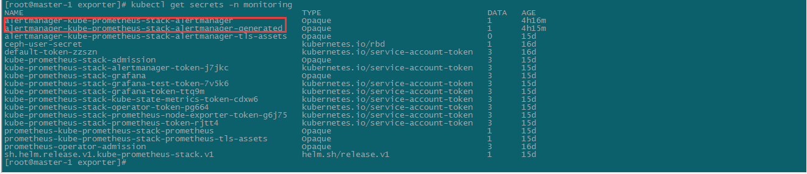

# Mysql_exporter

## 先决条件

1. 已搭建 Kubernetes；
2. 已部署 Prometheus ;
3. 已部署 Mysql。

## 创建 Mysql 用户

```sql
# 在被监控 mysql 中执行如下 sql，创建 mysql_exporter 对应用户
CREATE USER 'mysqlexporter'@"%"  IDENTIFIED BY 'mysqlexporter';
GRANT PROCESS, REPLICATION CLIENT, SELECT ON *.* TO 'mysqlexporter'@'%'  IDENTIFIED BY 'mysqlexporter' WITH MAX_USER_CONNECTIONS 30; 
GRANT select on performance_schema.* to "mysqlexporter"@"%" IDENTIFIED BY 'mysqlexporter';
flush privileges;
```

## 安装 Mysql Exporter

下载 mysql_exporter 的 chart：

```she
helm search repo mysql-exporter
helm pull stable/prometheus-mysql-exporter
tar -zxvf prometheus-mysql-exporter-0.7.1.tgz
```

修改 values.yaml 中的配置：

```shell
mysql:
  db: ""
  host: "<IP>"
  param: ""
  pass: "mysqlexporter"
  port: 3306
  protocol: ""
  user: "mysqlexporter"
  existingSecret: false
```

安装 mysql_exporter：

```shell
helm install mysql-exporter -f values.yaml ./prometheus-mysql-exporter -n sdp-test
```

## 创建 ServiceMonitor

```shell
# servicemonitor.yaml
apiVersion: monitoring.coreos.com/v1
kind: ServiceMonitor
metadata:
  labels:
    release: kube-prometheus-stack # prometheus 默认通过 prometheus: kube-prometheus 发现 ServiceMonitor，只要写上这个标签 prometheus 服务就能发现这个 ServiceMonitor
  name: prometheus-exporter-mysql
  namespace: monitoring
spec:
  jobLabel: mysql # jobLabel 指定的标签的值将会作为 prometheus 配置文件中 scrape_config下 job_name 的值，也就是target，如果不写，默认为 service 的 name
  selector:
    matchLabels:
      app: prometheus-mysql-exporter # 由于前面查看 mysql-exporter 的 service 信息中标签包含了 app: prometheus-mysql-exporter 这个标签，写上就能匹配到
      release: mysql-exporter
  namespaceSelector:
    any: true #表示从所有 namespace 中去匹配，如果只想选择某一命名空间中的 service，可以使用 matchNames: []的方式
    # mathNames： []
  endpoints:
  - port: mysql-exporter #前面查看 mysql-exporter 的 service 信息中，提供 mysql 监控信息的端口是 Port: mysql-exporter  9104/TCP，所以这里填 mysql-exporter
    interval: 30s #每30s获取一次信息
  # path: /metrics HTTP path to scrape for metrics，默认值为/metrics
    honorLabels: true
```

```shell
kubectl create -f servicemonitor.yaml
```

成功以后在 Prometheus 界面上可以看到如下 target：



## 配置告警规则

创建 PrometheusRule，mysql-rules.yaml：

```yaml
apiVersion: monitoring.coreos.com/v1 # 这和 ServiceMonitor 一样
kind: PrometheusRule  # 该资源类型是 PrometheusRule，这也是一种自定义资源（CRD）
metadata:
  labels:
    app: kube-prometheus-stack
    release: kube-prometheus-stack  # 同 ServiceMonitor，ruleSelector也会默认选择标签为 prometheus: kube-prometheus 的 PrometheusRule 资源
  name: prometheus-rule-mysql
  namespace: monitoring
spec:
  groups: # 编写告警规则，和 prometheus 的告警规则语法相同
  - name: mysql.rules
    rules:
    - alert: TooManyErrorFromMysql
      expr: sum(irate(mysql_global_status_connection_errors_total[1m])) > 10
      labels:
        severity: critical
      annotations:
        description: mysql产生了太多的错误.
        summary: TooManyErrorFromMysql
    - alert: TooManySlowQueriesFromMysql
      expr: increase(mysql_global_status_slow_queries[1m]) > 10
      labels:
        severity: critical
      annotations:
        description: mysql一分钟内产生了{{ $value }}条慢查询日志.
        summary: TooManySlowQueriesFromMysql
```

```shell
kubectl apply -f mysql-rules.yaml
```



更新 Alertmanager 配置：

```shell
kubectl describe sts alertmanager-kube-prometheus-stack-alertmanager -n monitoring
```





修改 alertmanager-kube-prometheus-stack-alertmanager，alertmanager.yaml：

```yaml
global:
  resolve_timeout: 5m
  smtp_smarthost: 'smtp.163.com:25'
  smtp_from: 'prometheusAlert0@163.com'
  smtp_auth_username: 'prometheusAlert0'
  smtp_auth_password: 'IPWIRJQJPFMBURFN'
  smtp_require_tls: false
route:
  group_by: ['alertname']
  group_wait: 30s
  group_interval: 5m
  repeat_interval: 12h
  receiver: 'email'
receivers:
- name: 'email'
  email_configs:
  - to: '13917665872@163.com'
templates:
- /etc/alertmanager/config/*.tmpl
```

```shell
base64 alertmanager.yaml > secrets.txt
kubectl edit secrets alertmanager-kube-prometheus-stack-alertmanager -n monitoring
```

将 Alertmanager.yaml 后面的内容替换为 secrets.txt 中的内容，并删除 alertmanager-kube-prometheus-stack-alertmanager-generated secret。

# Node_exporter

## 方案

利用 Prometheus 对 Kubernetes 集群监控，可以采用 Cadvisor + node-exporter + Prometheus + Grafana 的方案。

- 容器监控：Prometheus 使用 Cadvisor 采集容器监控指标，而 Cadvisor 集成在 K8S 的 kubelet 中所以无需部署，通过 Prometheus进程存储，使用 Grafana 进行展示。
- node 节点监控：node 端的监控通过 node_exporter 采集当前主机的资源，通过 Prometheus 进程存储，最后使用 Grafana 进行展示
- master 节点监控：master 的监控通过 kube-state-metrics 插件从 K8S 获取到 apiserver 的相关数据并通过网页页面暴露出来，然后通过 Prometheus 进程存储，最后使用 Grafana 进行展示。

## 部署

本文介绍采用 Helm3 部署 kube-prometheus-stack，如果想要手工部署 Prometheus，可以参考链接[2]。

```shell
kubectl create namespace monitoring

helm repo add prometheus-community https://prometheus-community.github.io/helm-charts

helm search repo  kube-prometheus-stack

helm pull prometheus-community/kube-prometheus-stack
```

```yaml
# 修改value.yaml中的存储部分

    ## Prometheus StorageSpec for persistent data
    ## ref: https://github.com/coreos/prometheus-operator/blob/master/Documentation/user-guides/storage.md
    ##
    storageSpec:
       volumeClaimTemplate:
         spec:
           storageClassName: harbor-ceph-rdb
           accessModes: ["ReadWriteOnce"]
           resources:
             requests:
               storage: 50Gi
    #    selector: {}
```

```shell
helm install kube-prometheus-stack ./kube-prometheus-stack --set rbacEnable=true --namespace=monitoring -f ./values.yaml
```

## Q&A

### Etcd 无法监控

Prometheus 默认监控 etcd 的 2379 端口，而新版本 kubeadm 安装的 ectd 的 metrics 端口改为 2381，故需要修改 values.yaml 中的ectd 端口并重启 kubelet，才能完成对 etcd 的正常监控。


### Kube-schduler 和 Kube-controller-manager 无法监控


kubeadm 安装默认会有 -port=0 参数，需要将其注释，添加 --address=0.0.0.0 的配置并重启 kubelet，才能监控。


### Kube-proxy 无法监控

默认情况下，kube-proxy 服务监听端口只提供给 127.0.0.1，需修改为 0.0.0.0

```shell
kubectl edit cm/kube-proxy -n kube-system
```


```shell
# 重启 kube-proxy
kubectl delete pod -l k8s-app=kube-proxy -n kube-system
```

# 参考链接

[1]: https://www.yuque.com/youngfit/qok2pe/nypstd#b8abd38a	"组件监控实例"
[2]: https://baijiahao.baidu.com/s?id=1798722273949066044&amp;wfr=spider&amp;for=pc	"Prometheus 部署"
[3]: https://baijiahao.baidu.com/s?id=1775453145487726755&amp;wfr=spider&amp;for=pc	"kube-prometheus-stack"
[4]: https://blog.51cto.com/u_15481067/11749135	"Metrics-Server"

